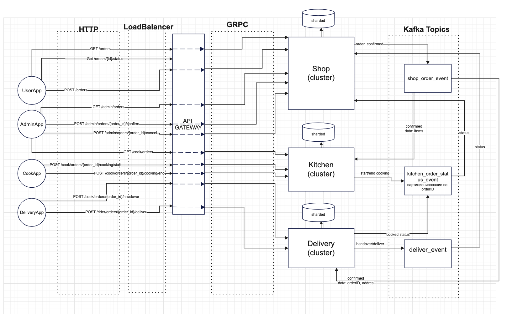

# kitchen
# interaction scheme  

interservice interaction protocol - grpc: fast, auto generation client, easy to use
message broker - kafka: high performance, good for scaling
database - postgres, free, extendable, good for scaling

some tests in internal/pkg/logger
dockerfile at /build

